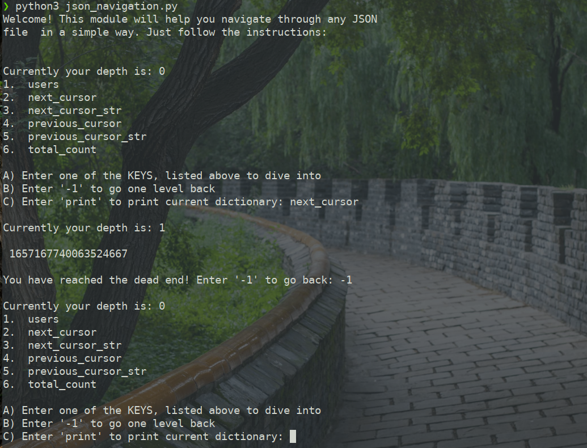
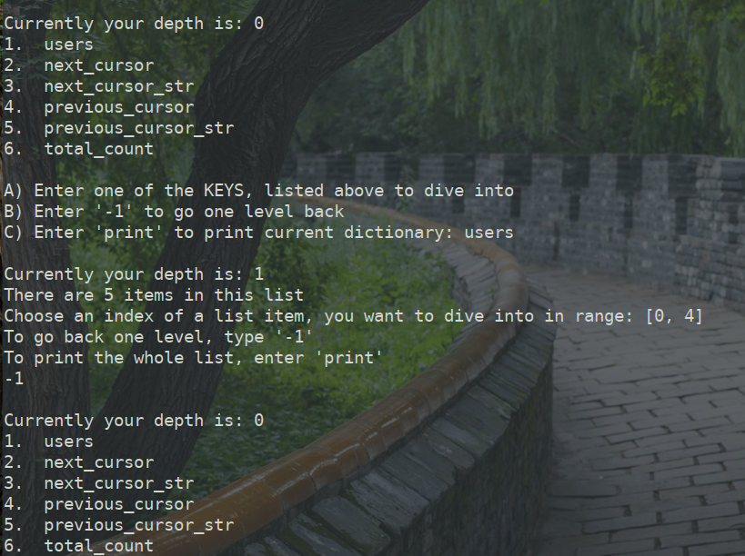

# JSON Navigator

### This reository is written on Python programming language(Version 3.7+) to help people navigate through the JSON file with ease through the terminal window

> Two integrated Python modules were used in this module: json and copy

```bash
python3 json_navigate.py
```
#### User can easily go deeper into json, print parts of it. 
___
## Some Exmples:
#### Getting started

#### If you reached the dead end program will inform you and suggest to return back

#### If there is a list inside, it will handle it in a cool way

